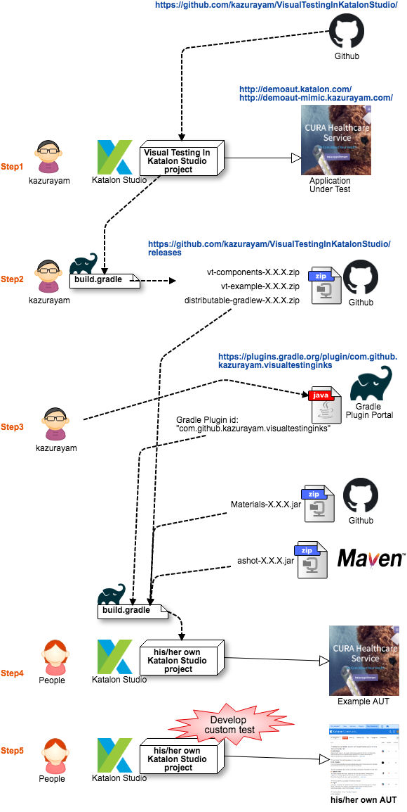

# visualtestinginks --- a Gradle Plugin

author: kazurayam

April, 2019

## Overview

This project is a [Gradle](https://gradle.org/) project where kazurayam (it's me) develops a custom Gradle Plugin [`com.github.kazurayam.visualtestinginks`](https://plugins.gradle.org/plugin/com.github.kazurayam.visualtestinginks).

The Gradle Plugin `com.github.kazurayam.visualtestinginks` is available for any [Katalon Studio](https://www.katalon.com/) users at the [Gradle Plugin Portal](https://plugins.gradle.org/plugin/com.github.kazurayam.visualtestinginks).

The Gradle Plugin `com.github.kazurayam.visualtestinginks` is developed in order to make [*VisualTestingInKatalonStudio*](https://github.com/kazurayam/VisualTestingInKatalonStudio) project portable to other Katalon Studio projects. With the resources imported, his/her Katalon projects becomes capable of screenshot-comparison testing just as *VisualTestingInKatalonStudio* does.


## How related projects interact

The following figure shows how multiple projects relate, and how the *VisualTestingInKatalonStudio* project components are ported into peoples's own Katalon Studio projects so that he/she can do screenshot-comparison testings against his/her own Application Under Test.



### Step1

- kazurayam develops *VisualTestingInKatalonStudio* project. He stores and shares the source code at GitHub https://github.com/kazurayam/VisualTestingInKatalonStudio
- The *VisualTestingInKatalonStudio* project includes 2 sets of example. The first example is called **Twins**, which takes screenshots and campares a pair of URLs (production environment and development environment). The 2nd example is called **Chronos**, which takes current set of screenshots of a URL and compares against another set of screenshots of the same URL previously taken.

### Step2

- kazurayam creates 3 archive files:
  1. `vt-components-X.X.X.zip`
  2. `vt-example-X.X.X.zip`
  3. `distributable-gradlew-X.X.X.zip`
- These archive files contains artifacts developed by the *VisualTestingInKatalonStudio* project.
  1. `vt-components-X.X.X.zip` contains reusable Katalon Studio resources (Test Cases, Test Suites, Test Listener, Keywords) that implement the functionality of screenshot-comparison testing.
  2. `vt-example-X.X.X.zip` contains a set of Katalon Studio resources (Test Cases, Test Suites, Execution Profiles, Object Repository) that implement WebUI testing against the Katalon demo site (http://demoaut.katalon.com).
  3. `distributable-gradlew.zip` contains a set of files which implements [Gradle Wrapper](https://docs.gradle.org/current/userguide/gradle_wrapper.html). People, who has not installed JDK and Gradle into his/her PC, can use the Gradlew contained in this zip, and by `gradlew` command, can import the `vt-*` resources and External Libraries into his/her own project.

### Step3

- kazurayam develops a Gradle Plugin with id `com.github.kazurayam.visualtestinginks`. The plugin is published at the Gradle Plugin Portal https://plugins.gradle.org/plugin/com.github.kazurayam.visualtestinginks
- The source code of the Gradle plugin is stored and shared at GitHub https://github.com/kazurayam/visualtestinginks-gradle-plugin

### Step4

- People creates a new Katalon Studio project.
- If he/she wants to make the project enabled to do Visual Testing, he/she should make a `build.gradle` file in his/her project's root directory.
- The build file declares to use the above-mentioned Gradle Plugin `com.github.kazurayam.visualtestinginks`.
- He/she will execute a command line operation:
```
$ cd %%
$ .\gradlewks -b build.gradle enableVisualTesting
```
- The `enableVisualTesting` task will the following:
  1. it downloads `vt-components-X.X.X.zip` and deploys the contents in the project directory.
  2. it downloads `vt-example-X.X.X.zip` and deploys the contents in the project directory.
  3. it downloads `Materials-X.X.X.jar`, which is the core part of the *VisualTestingInKatalonStudio* from GitHub.
  4. it downloads `ashot-X.X.Xjar` and a few other Java libraries from the Maven Central repository.
- By executing `$ gradle enableVisualTesting` task, his/her Katalon Project becomes capable of running the Visual Testing example. He/sh can execute `Test Suites/CURA/Execute_twins` and `Test Suites/CURA/Execute_chronos`.

### Step5

- The `enableVisualTesting` task in the Step4 creates a few resources named with symbol "CURA". For example:
  1. `Test Suites/CURA/Execute_twins`
  2. `Test Suites/CURA/Execute_chronos`
  3. `Test Cases/CURA/visitSite`
  4. `Test Cases/CURA/restorePreviousScreenshots`
- He/she should copy these "CURA"-named files to make new code set of "Visual Testing" for their own Application Under Test.
- He/she will make `Test Cases/MyUAT/visitSite` and rewrite it completely so that it visits their own Application Under Test and takes screenshots.
- Once their `Test Cases/MyUAT/visitSite` is rewritten to target their onw AUT, preparetion is alomst done. They will be able to execute **Twins** test and **Chronos** test against their own AUT.

## How you can enable your Katalon project capable of Visual Testing

see [User Guide](docs/userguide.md) for detail instruction.

## How kazurayam publishes vt-components-X.X.X.zip and other distributables

see [Developer Guide](docs/developerguide.md) for detail information.
